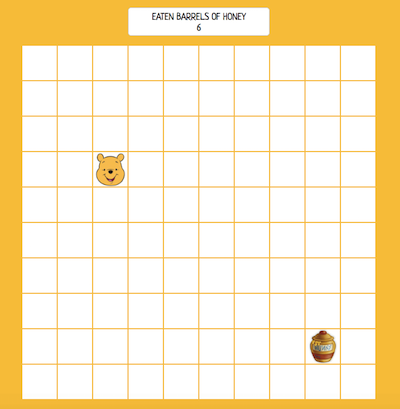
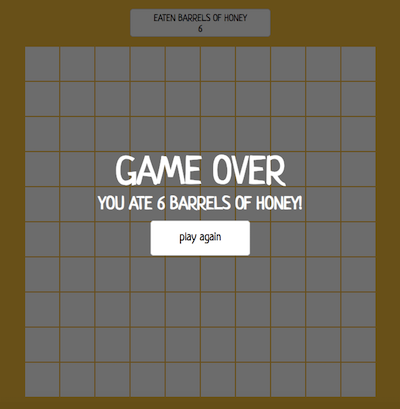

# Winnie the Pooh Game

It's time for a little something! 🍯 Help Winnie the Pooh eat some honey by moving the bear across the board with arrows on your keyboard: ↑ ↓ ← →


## Getting Started

To run this project you need to have **Node.js** installed on your local machine. After forking and cloning the repo please run these commands in your command line:

```
npm install
```

and

```
npm start
```

Then open the **index.html** file in your browser.


## Tools

- JavaScript (ES6)
- CSS
- HTML
- Webpack


## Demo

### [Winnie the Pooh Game](https://karin-on.github.io/winnie-game/)


## Previews

    

